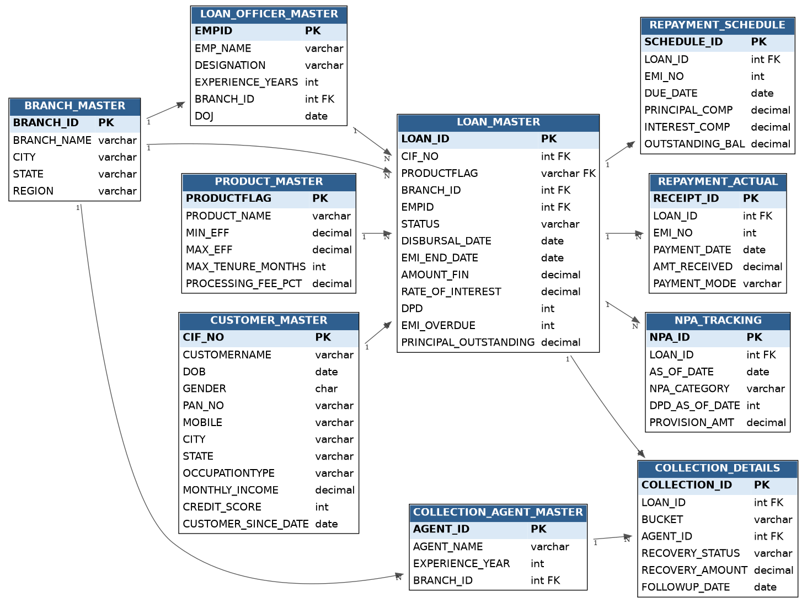

# Banking SQL Analytics

End-to-end SQL analytics portfolio project simulating an NBFC (Non-Banking Financial Company) retail lending portfolio — schema design, realistic data, and 40 business-driven SQL case studies from basic querying through window functions.

## Overview

This project models the core of a retail lending system: customers, loans, products, branches, repayment schedules, collections, and NPA (Non-Performing Asset) tracking. It's built inspired by common data structures used in BFSI operations — CIF-based customer identity, DPD/EMI-driven loan lifecycle, bucket-based collections, and point-in-time NPA snapshots.

Each of the 40 SQL solutions is written as a mini case study: **business requirement → approach → SQL → explanation → business insight** — not just a query, but the reasoning a data analyst would document for a stakeholder.

## Project Highlights

- Designed a normalized PostgreSQL database with 10 relational tables.
- Solved 40 real-world banking business problems using SQL.
- Covered advanced SQL concepts including CTEs, window functions, EXISTS, correlated subqueries, and ranking functions.
- Simulated an NBFC retail lending portfolio with customers, loans, repayments, collections, and NPA tracking.
- Organized SQL solutions by topic for easy navigation and learning.

## Schema

10 normalized tables, PostgreSQL:

| Table | Purpose |
|---|---|
| `BRANCH_MASTER` | Branch location and region details |
| `PRODUCT_MASTER` | Loan products, interest bands, tenure limits |
| `CUSTOMER_MASTER` | Customer demographics and KYC (CIF-based) |
| `LOAN_OFFICER_MASTER` | Loan officers, branch-attached |
| `COLLECTION_AGENT_MASTER` | Recovery agents, branch-attached |
| `LOAN_MASTER` | Central fact table — one row per loan (status, DPD, outstanding) |
| `REPAYMENT_SCHEDULE` | Planned EMI schedule per loan |
| `REPAYMENT_ACTUAL` | Actual payments received per loan |
| `COLLECTION_DETAILS` | Recovery follow-ups, DPD buckets, recovery status |
| `NPA_TRACKING` | Point-in-time NPA classification and provisioning |

Full DDL with design rationale for every table: [`Database/create_tables.sql`](Database/create_tables.sql)



## Tech Stack

- **Database:** PostgreSQL
- **SQL concepts covered:** joins (INNER/LEFT/SELF), EXISTS/NOT EXISTS, correlated subqueries, CTEs, window functions (`ROW_NUMBER`, `RANK`, `DENSE_RANK`, `LEAD`, `LAG`), running totals, moving averages, date/string functions

## Skills Demonstrated

- SQL
- PostgreSQL
- Relational Database Design
- Data Cleaning
- Business Analytics
- Financial Data Analysis
- Window Functions
- Common Table Expressions (CTEs)
- Query Optimization
- Data Aggregation
- Banking Domain Analytics

## Repository Structure

```
Banking-SQL-Analytics/
├── Database/
├── ER_Diagram/
├── Case_Study/
│   ├── 01_basic.sql
│   ├── 02_aggregate_functions_conditional_logic.sql
│   ├── 03_sql_joins.sql
│   ├── 04_exists_subqueries.sql
│   ├── 05_ctes.sql
│   ├── 06_window_functions.sql
│   └── business_questions.md
├── LICENSE
└── README.md
```

## Dataset

The sample dataset used in this project is included in CSV format for reproducibility. It contains synthetic banking data including:

- Customers
- Loans
- Products
- Branches
- Loan Officers
- Collection Agents
- Repayment Schedule
- Repayment Actual
- Collections
- NPA Tracking

## Getting Started

```bash
# 1. Create the schema
psql -U <user> -d <database> -f Database/create_tables.sql

# 2. Load the data (run from inside psql, or via \copy for client-side loading)
\copy BRANCH_MASTER FROM 'Database/01_BRANCH_MASTER.csv' WITH (FORMAT csv, HEADER true)
\copy COLLECTION_AGENT_MASTER FROM 'Database/02_COLLECTION_AGENT_MASTER.csv' WITH (FORMAT csv, HEADER true)
\copy COLLECTION_DETAILS FROM 'Database/03_COLLECTION_DETAILS.csv' WITH (FORMAT csv, HEADER true)
\copy CUSTOMER_MASTER FROM 'Database/04_CUSTOMER_MASTER.csv' WITH (FORMAT csv, HEADER true)
\copy LOAN_MASTER FROM 'Database/05_LOAN_MASTER.csv' WITH (FORMAT csv, HEADER true)
\copy LOAN_OFFICER_MASTER FROM 'Database/06_LOAN_OFFICER_MASTER.csv' WITH (FORMAT csv, HEADER true)
\copy NPA_TRACKING FROM 'Database/07_NPA_TRACKING.csv' WITH (FORMAT csv, HEADER true)
\copy PRODUCT_MASTER FROM 'Database/08_PRODUCT_MASTER.csv' WITH (FORMAT csv, HEADER true)
\copy REPAYMENT_ACTUAL FROM 'Database/09_REPAYMENT_ACTUAL.csv' WITH (FORMAT csv, HEADER true)
\copy REPAYMENT_SCHEDULE FROM 'Database/10_REPAYMENT_SCHEDULE.csv' WITH (FORMAT csv, HEADER true)

# 3. Run the case study queries
psql -U <user> -d <database> -f Case_Study/01_basic.sql
```

> Load tables in the order above — parent tables (branch, product, customer, officer, agent) must exist before `LOAN_MASTER`, which in turn must exist before the schedule/actual/collection/NPA tables, due to foreign key constraints.

## Case Studies

40 business questions across 9 levels, in [`Case_Study/`](Case_Study/):

| File | Topics | Questions |
|---|---|---|
| [`01_basic.sql`](Case_Study/01_basic.sql) | SELECT, WHERE, ORDER BY, aggregates, COALESCE | Q1–Q10 |
| [`02_aggregate_functions_conditional_logic.sql`](Case_Study/02_aggregate_functions_conditional_logic.sql) | GROUP BY, HAVING, CASE | Q11–Q14 |
| [`03_sql_joins.sql`](Case_Study/03_sql_joins.sql) | INNER/LEFT/SELF JOIN | Q15–Q18 |
| [`04_exists_subqueries.sql`](Case_Study/04_exists_subqueries.sql) | EXISTS, NOT EXISTS, correlated subqueries, date/string functions | Q19–Q31 |
| [`05_ctes.sql`](Case_Study/05_ctes.sql) | Common Table Expressions | Q32–Q34 |
| [`06_window_functions.sql`](Case_Study/06_window_functions.sql) | ROW_NUMBER, RANK, DENSE_RANK, LEAD, running totals, moving averages | Q35–Q40 |

Full question list with business context: [`Case_Study/business_questions.md`](Case_Study/business_questions.md)

### Sample

**Q36. Identify the Top 3 loan officers by total loan disbursement within each branch.**

```sql
SELECT
     EMP_NAME,
     BRANCH_ID,
     TOTAL_AMT_FIN
FROM(SELECT 
	LO.EMP_NAME,
	L.BRANCH_ID,
	SUM(L.AMOUNT_FIN) AS TOTAL_AMT_FIN,
	RANK() OVER(PARTITION BY L.BRANCH_ID ORDER BY SUM(L.AMOUNT_FIN) DESC) AS TOP_RANK
FROM LOAN_MASTER AS L
LEFT JOIN LOAN_OFFICER_MASTER AS LO
ON L.EMPID = LO.EMPID
GROUP BY L.BRANCH_ID,LO.EMP_NAME) AS T
WHERE TOP_RANK <= 3;
```

## Future Enhancements

- Dashboard development using Tableau / Power BI
- SQL performance optimization examples
- Stored Procedures
- Views and Materialized Views
- Indexing demonstrations
- Additional banking analytics scenarios

## About Me

I'm a Data Analyst with experience in SQL, PostgreSQL, Tableau Prep, Python, and banking operations. This repository showcases my practical SQL skills through realistic banking analytics scenarios inspired by real-world business problems.

## License

MIT — see [`LICENSE`](LICENSE).